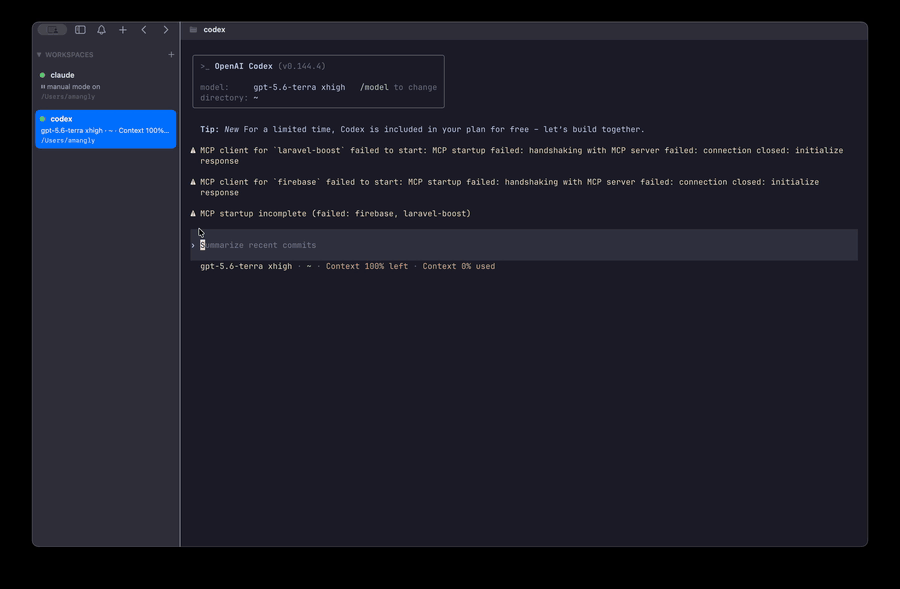

<p align="center">
  <picture>
    <source media="(prefers-color-scheme: dark)" srcset="assets/logo-white-256.png">
    
  </picture>
</p>

# zide

A terminal built for running many AI coding agents in parallel, growing into
a full AI-native development workspace. One app: multiplexer-grade terminal,
managed git-worktree isolation per agent task, and — over time — an editor,
git UI, and native agent with inline diffs.

Think [cmux](https://cmux.com) + [terax](https://terax.app), combined, with
the core written in Zig.

<p align="center">
  <a href="https://github.com/amangly/zide/raw/main/assets/zide-overview.mp4">
    
  </a>
</p>

> _Overview: agent-aware workspaces (Claude and Codex running side by side),
> recursive terminal splits, and a docked browser — all daemon-backed.
> Click for the full-quality video._

**Status: pre-alpha, but real.** A daemon owns sessions and PTY panes (they
survive the app); the macOS app renders them on GPU libghostty surfaces in a
cmux-style workspace — recursive splits, a docked WebKit browser, and a
sidebar that follows what each pane is running (an agent, a command, a
directory). AI agents run as ordinary processes; the shell detects and
surfaces them. macOS-first; Linux and the editor are next. See
[ROADMAP.md](ROADMAP.md).

```sh
zig build && ./macos/build.sh && open macos/out/Zide.app
```

## Install (macOS)

Build and install a self-contained `Zide.app` into `/Applications` — the
`zide` daemon binary and all resources are bundled, so nothing else is
needed afterward:

```sh
./macos/install.sh                       # → /Applications/Zide.app
PREFIX=~/Applications ./macos/install.sh # install elsewhere
```

Or build a drag-to-Applications disk image to share:

```sh
./macos/make-dmg.sh                      # → macos/out/Zide-<version>.dmg
```

The dev build is ad-hoc signed. To sign (and enable browser passkey /
Touch ID sign-in) pass a Developer ID:

```sh
CODESIGN_IDENTITY="Developer ID Application: You (TEAMID)" ./macos/install.sh
```

## What it will be

- **Agent multitasking** — spawn CLI agents (Claude Code, Codex, Aider, …)
  as first-class tasks, each isolated in its own git worktree + branch,
  with attention notifications and a review → merge → clean-up flow.
- **Multiplexer terminal** — libghostty-powered panes, vertical tabs
  showing branch/dir/ports, split layouts, session restore.
- **IDE, eventually** — our own editor core (rope buffers, tree-sitter,
  LSP, Vim emulation, GPU rendering), git commit graph, web preview,
  and a native agent that proposes inline diffs.

## Architecture in one paragraph

All logic lives in a UI-agnostic Zig core shaped like a server (sessions,
panes, PTYs, agent tasks behind a message-passing API). Thin native shells
render it: Swift/AppKit on macOS first, GTK on Linux second. Terminal
emulation comes from embedding libghostty; editor text gets a custom Zig
GPU renderer. The server-shaped core later becomes a detached daemon —
unlocking live session survival, SSH workspaces, and the automation
socket/CLI — without a rewrite.

## Building

Requires **Zig 0.15.2** exactly (pinned to match Ghostty v1.3.1, our
terminal engine dependency). Setup details in
[CONTRIBUTING.md](CONTRIBUTING.md).

```sh
zig build test   # run tests
zig build run    # dev CLI (event-loop demo)
```

## Documentation

| Doc | What's in it |
|---|---|
| [ZIDE.md](ZIDE.md) | Living project map: modules, conventions, gotchas |
| [docs/ARCHITECTURE.md](docs/ARCHITECTURE.md) | Design decisions and their rationale |
| [ROADMAP.md](ROADMAP.md) | Phase plan and status |
| [CONTRIBUTING.md](CONTRIBUTING.md) | Environment setup and workflow |

## License

[Apache-2.0](LICENSE)
